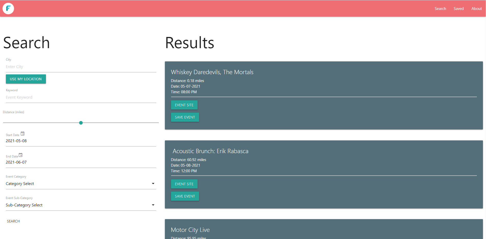

# Fun-Finder

## Description
The fun finder app uses the ticketmaster api to allow the user to search for events. The site alllows them to search by city, keyword, date, and event type. The resultig events can be saved into local storage and accessed in later browser sessions. If saved events fall within one week of the current day the user can look at a weather forcast for the day and location associated with that event. The search also allows the user to use their ip address location as the city input.

## APIS
The site utalized the ticketmaster api whic is used to find events and event information based on the user search. The openweathermap api is also used to get the weather data on the saved events page and to convert from city name to latitude and longitude. The Abstract api is used to get the users location information based on their ip address.

## Style
The site was designed with a mobile first approach using the materialize css framework. Elements were chosen based on their mobile  usability and then the site was expanded to remain user friendly at larger screen sizes. 

# Future Improvements

## Search
Many aspects of the site can be iproved upon. The search can be made to have more options like: sorting criteria, addrees (as opposed to just city), and a time of day option. 

## Local Storage
The system that controls localstorage can be expanded to accomidate events that have the same name but occur on different dates. Currently, localstorage prevents duplicate events from being saved by checking the name of the event that is being saved against the names of the events currently in localstorage. This does not take into account that there are events (like soports games) that have the same name, but occur on different dates (two teams play each other on two differet days). Currently only one of those events could be saved in local storage, but thid could be fixed by making the duplicate prevention sytem check event name and date.

## Home Page
Currently the home page and the results page could be made into one page, so we want to differentiate the home page by giving the users quick links to exicute searches. For instance, these links could say "find sporting events near me", or "find concerts near me" and when clicked hey could exicte a search based on that links catagory and the usrs ip location.

## Map
At te outset of this project we considered building in some map functionality to the site, but found ourselvs with too little time to exicute that plan. It would be nice for users to be able to see their location on google maps-like layout or to even be able to display results on a map rather than as alist. More reaserch needs to be done into map options and how they can be incorperated into a site like Fun-Finder.